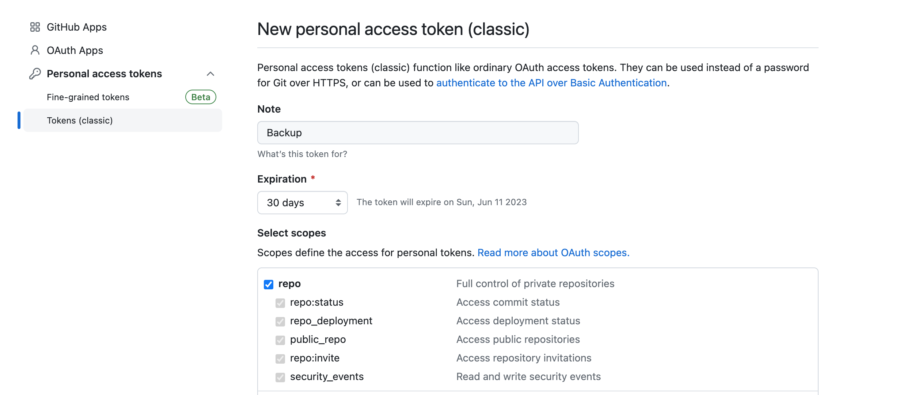

# GitHub Backup 💾

Save your GitHub repositories to a local directory.

## Dependencies

You must have [Node.js](https://nodejs.org/en) and `npm` installed globally on your machine.

Then, install the project dependencies:

```bash
npm install
```

## Setup your credentials

Create a [personal access token (classic)](https://github.com/settings/tokens/new) with the `repo` scope.



## Usage

### 1 - Setup your environment variables

Export your variables by running the following commands in your terminal:

```bash
export GITHUB_TOKEN="<personal-access-token>"
export BACKUP_DIR="<path-to-backup-directory>"
```

> `BACKUP_DIR` is the absolute path to the directory where you want to save your repos.

### 2 - Save your repos

This script will clone all your repositories to the `BACKUP_DIR` directory.

```bash
npm run clone
```

### 3 - (Optional) Save public repos

You might want to save some cool GitHub public repositories as well.

To do so, add the URL of the repos in the `repos.json` file and run the following command:

```bash
npm run public
```

> They will be saved in the `$BACKUP_DIR/public` directory.
